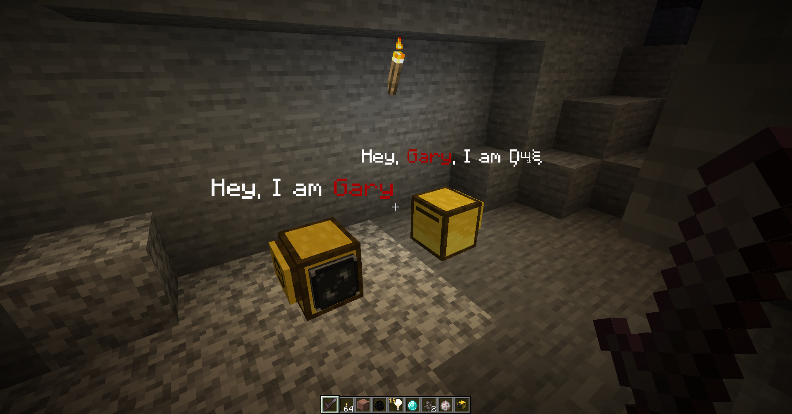

# Turtle chatter

Turtle chatter is a small module that allows you to display messages above turtle.

> [!info]
> - Text will be additionally wrapped and text will be shifted to new line in case when it is longer than 160 pixels.
> - Line breaker symbol `\n` works.
> - Currently message can be only 6 lines, extra lines will be ignored.

> [!warning]
> This upgrade is experimental. Text render can sometimes be pretty ugly, also this is possible for API changes

| Function                 | Returns | Description                    |
|--------------------------|---------|--------------------------------|
| getMessage()             | string? | Returns current stored message |
| setMessage(text: string) | nil     | Update stored message          |
| clearMessage()           | nil     | Clears stored message          |

> [!tip] How can I get colored text?
> You can pass [minecraft formatting](https://minecraft.fandom.com/el/wiki/Formatting_codes) symbols. For example `setMessage("\xA74Red message")` will generate red message, because `\xA7` converts into § and `4` is dark red.
